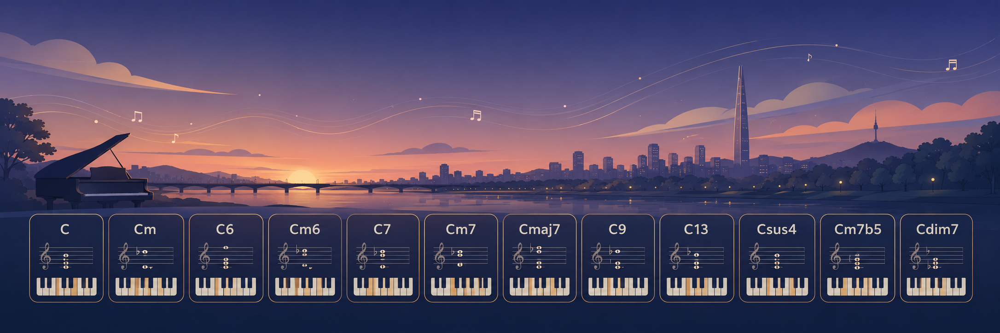
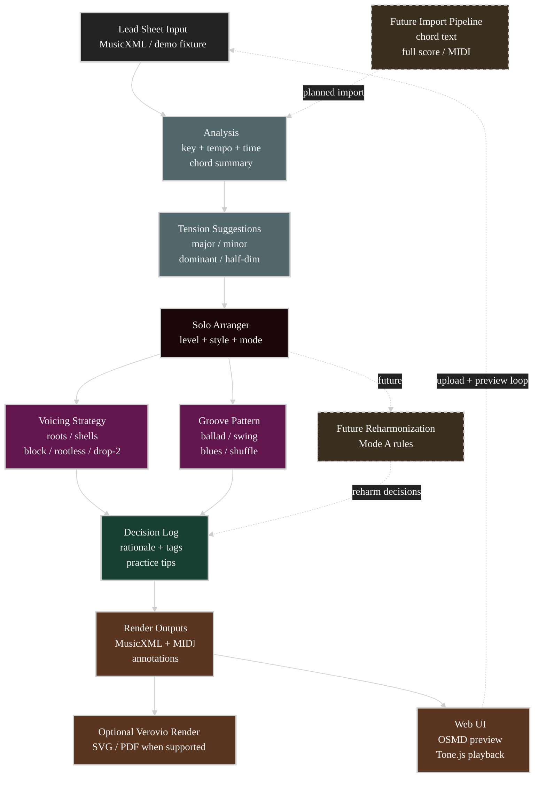

# bluesify

[](https://github.com/ziwon/bluesify/actions/workflows/ci.yml)


Step-by-step jazz/blues piano arrangement engine for self-learning.
Bluesify takes a MusicXML lead sheet, analyzes its harmony, and produces
progressive solo-piano arrangements with MIDI, MusicXML, and structured
teacher annotations.



## Status

Phase 1 is implemented for Mode B: jazz-standard style lead sheets arranged for
solo piano. Levels 1-5 are playable for the copyright-safe canonical fixture.

Currently supported:

- Solo piano mode
- Jazz ballad arrangement path
- Levels 1-5
- Chord tension teaching for common jazz chord qualities
- FastAPI/static web UI with score preview and MIDI playback

Not yet implemented:

- Accompaniment mode
- Full reharmonization Mode A
- General song import pipeline
- Production deployment

## Goals

- **Mode A**: Pop/song scores -> jazz/blues reharmonization
- **Mode B**: Jazz standards -> step-by-step learning arrangements
- Performance modes: Solo piano / Accompaniment
- Each level produces MusicXML + MIDI + structured rationale
- Optional render output through Verovio when installed
- Rule-based teacher annotations, with an LLM teacher planned later

## Quick Start

```bash
# Setup
just sync

# Analyze harmony and teaching notes
just analyze

# Arrange all solo levels, 1 through 5
just arrange level=5
```

Generated files:

- `*.musicxml`
- `*.mid`
- `*.annotations.json`
- `*.svg` when `just sync-render` is installed and Verovio is available
- `*.pdf` only when the installed Verovio Python binding supports PDF export

## Web UI

Bluesify includes an iPad-first, no-build web app. FastAPI wraps the engine;
the frontend renders arranged scores with OpenSheetMusicDisplay and plays MIDI
through Tone.js.

```bash
just sync-web
just serve            # http://127.0.0.1:8000
just serve-reload     # dev auto-reload
```

Open the page, tap **Load demo** or upload your own MusicXML lead sheet, choose
a level/style, and press play.

Upload support:

- `.musicxml`
- `.xml`
- `.mxl`
- `.mid`
- `.midi`

MusicXML lead sheets with melody plus chord symbols are the recommended input.
MIDI can be parsed, but it usually lacks chord symbols, so analysis and
arrangement quality may be limited.

## Arrangement Levels

| Level | Name | Current behavior |
|-------|------|------------------|
| 1 | Root & Melody | Left-hand root under the melody |
| 2 | Shell Voicings | 3rd/7th guide-tone shells |
| 3 | Walking Bass | Quarter-note bass line between chord roots |
| 4 | Block Chords | Melody harmonized with chord tones |
| 5 | Full Arrangement | Block chords, tensions, intro/outro frames |

## Development

This is a modern `src/` layout Python project. Local workflows are exposed
through `just`; the recipes use `uv` under the hood.

```bash
just sync
just check
just serve
just arrange level=5
```

CI runs the same checks on pull requests and pushes to `main`.

## Project Layout

```text
src/bluesify/
  analysis/   Score analysis and tension suggestions
  arranger/   Arrangement engines
  core/       Score I/O, chord normalization, shared models
  render/     Optional Verovio rendering helpers
  voicings/   Piano voicing strategies
  web/        FastAPI backend + static frontend
tests/        Pytest suite with copyright-safe generated fixtures
docs/         Plans, theory notes, rule diagrams, import pipeline notes
examples/     Generated sample outputs
```

## Architecture



## Import Pipeline

General songs often need conversion before Bluesify can arrange them. The
recommended future path is:

1. Chord text -> lead sheet MusicXML
2. Full MusicXML -> simplified lead sheet
3. MIDI -> inferred lead sheet with confidence warnings
4. PDF/image and audio import later

See [docs/import_pipeline.md](docs/import_pipeline.md) for the proposed design.

## License

MIT. Do not commit copyrighted source MusicXML files. Use synthesized or
verified copyright-safe fixtures for tests and demos.
