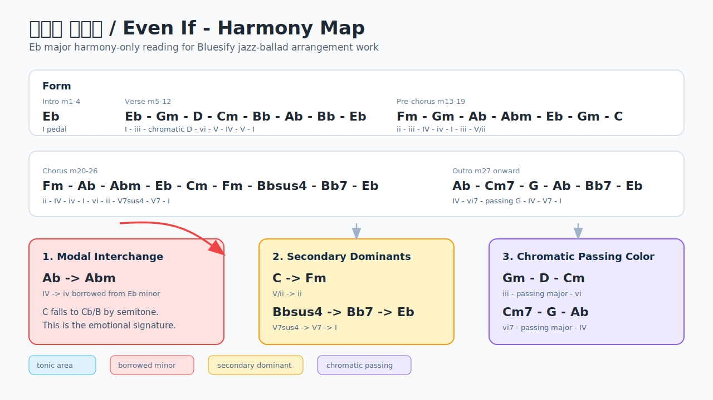
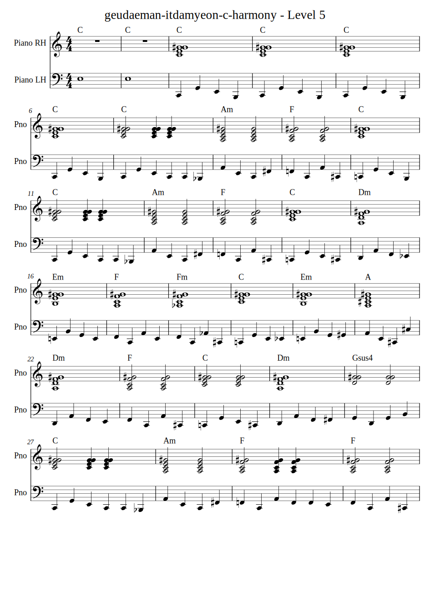

# Loveholic - Geudaeman Itdamyeon / Julian Lerner - Even If

This case study documents a harmony-only Bluesify experiment around Loveholic's
`Geudaeman Itdamyeon` and Julian Lerner's English cover `Even If`.

  

It intentionally omits melody, lyrics, and any third-party lead-sheet
transcription. The goal is to capture arrangement reasoning that can be reused
for Bluesify's jazz-ballad and reharmonization workflows.

## Harmony Map

## Case Study Input

Tracked harmony-only input:

- [examples/case_studies/geudaeman-itdamyeon-c-harmony.musicxml](../../examples/case_studies/geudaeman-itdamyeon-c-harmony.musicxml)

Current Level 5 jazz-ballad preview:

## Source Boundary

The working material was a local, user-provided harmony-only MusicXML chart in
Eb major. The generated MusicXML, MIDI, annotations, and full arrangement SVG
outputs remain under `examples/output/`, which is intentionally ignored by git.

Do not commit copyrighted source MusicXML, melody transcriptions, lyrics, or
large generated output directories without redistribution rights.

## Source Links

- Official artist page: <https://julianlerner.com/>
- Official music video: <https://www.youtube.com/watch?v=orbICj89nJk>
- Spotify track page: <https://open.spotify.com/track/6HhQU8qouMcn0qDKSt8Vfr>

## Form and Progression

| Section | Measures | Eb major progression | Roman-numeral reading |
| --- | ---: | --- | --- |
| Intro | m1-4 | Eb | I pedal / tonic frame |
| Verse | m5-12 | Eb - Gm - D - Cm - Bb - Ab - Bb - Eb | I - iii - chromatic D - vi - V - IV - V - I |
| Pre-chorus | m13-19 | Fm - Gm - Ab - Abm - Eb - Gm - C | ii - iii - IV - iv - I - iii - V/ii |
| Chorus | m20-26 | Fm - Ab-Abm - Eb-Cm - Fm - Bbsus4-Bb7 - Eb | ii - IV-iv - I-vi - ii - V7sus4-V7 - I |
| Outro | m27 onward | Ab - Cm7-G - Ab - Bb7 - Eb | IV - vi7-chromatic G - IV - V7 - I |

## Core Devices

### IV -> iv Modal Interchange

The emotional signature is `Ab -> Abm`: IV moving to borrowed iv in Eb major.
The voice-leading is compact and expressive because `C` falls to `Cb` (`B`
enharmonically) while the bass root stays on Ab. This one-semitone darkening is
more important than any large reharmonization gesture.

For Bluesify, this should be treated as a recurring color device. A jazz-ballad
arrangement should voice it clearly, preferably with the semitone motion in an
audible upper or inner voice.

### Secondary Dominants

`C` works as `V/ii`, resolving into `Fm`. The `Bbsus4 -> Bb7 -> Eb` cadence is
the main dominant-to-tonic arrival. These are natural places to add jazz color
without changing function:

- `C7(b9) -> Fm`
- `Bb13sus4 -> Bb7`
- `Bb7(b9) -> Eb`

The key is to preserve the release into `Fm` or `Eb`; altered colors should
increase tension, not obscure the cadence.

### Chromatic Passing Dominants

The verse `D` is the most interesting non-diatonic chord. It could be labeled
`V/iii` in isolation, but in context it appears after `Gm` and moves toward
`Cm`, so it behaves better as chromatic passing color than as a clean
tonicization.

A likely arrangement reading is an inner or bass line such as `G -> F# -> F/Eb`.
The later `G` between `Cm7` and `Ab` has a similar passing-dominant flavor.

## Bluesify Arrangement Reading

The strongest jazz-ballad approach is restrained. The song already has enough
emotional harmonic material: modal interchange, secondary dominants, and a few
chromatic major colors. Bluesify should make those moments audible rather than
reharmonizing every bar.

Useful arrangement rules:

- Keep the early Eb tonic area spacious.
- Voice `Ab -> Abm` with close semitone motion.
- Upgrade plain triads to 6th, maj7, or add9 colors where they do not blur the
  form.
- Treat `D` and `G` as passing colors, not full modulations.
- Save altered dominants for arrivals such as `C -> Fm` and
  `Bbsus4 -> Bb7 -> Eb`.

## C Transposition

For piano study, the Eb harmony can be transposed down a minor third into C.

| Eb chart | C chart |
| --- | --- |
| Eb | C |
| Gm | Em |
| D | B |
| Cm | Am |
| Bb | G |
| Ab | F |
| Fm | Dm |
| Abm | Fm |
| C | A |
| Bbsus4 | Gsus4 |
| Bb7 | G7 |
| Cm7 | Am7 |
| G | E |

In C, the same emotional devices become `F -> Fm`, `A -> Dm`,
`Gsus4 -> G7 -> C`, and chromatic passing `B`/`E` colors.
