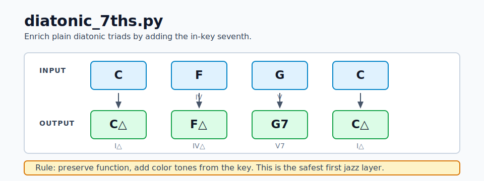
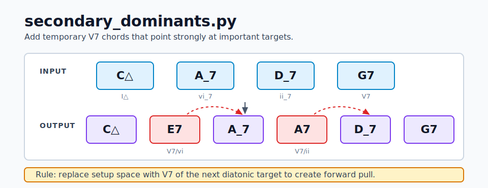
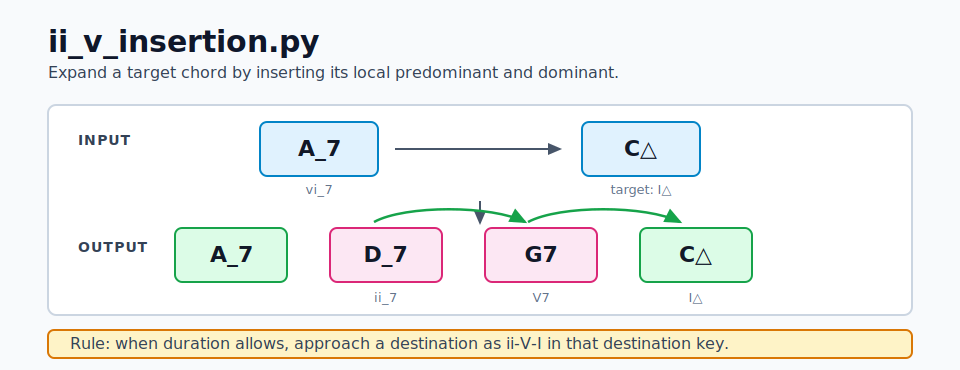
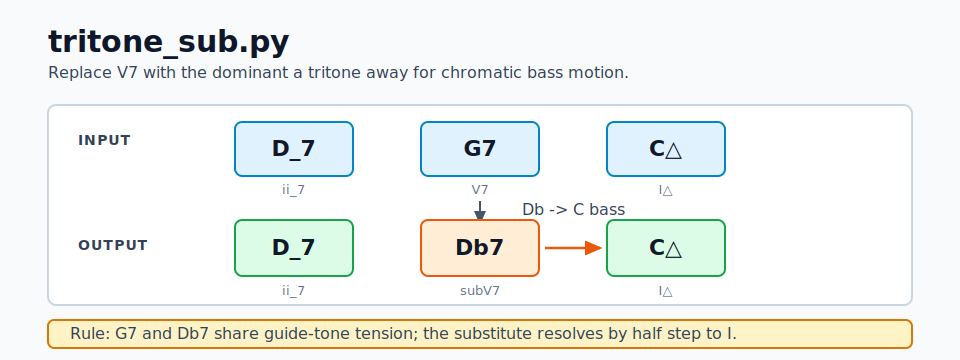
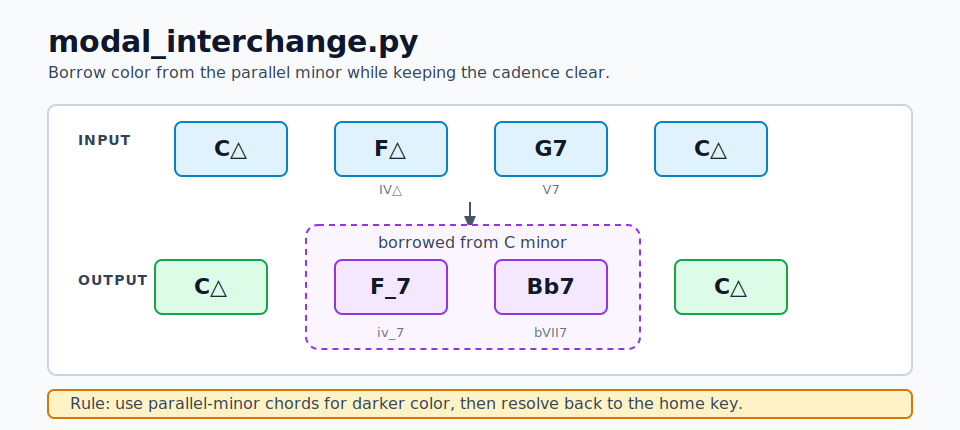
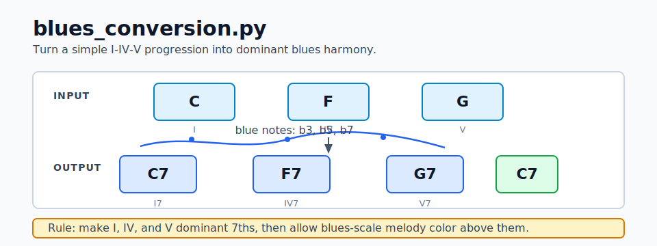

# Reharmonization Rule Diagrams

These SVG diagrams illustrate the planned Mode A reharmonization rules.
They use short, generic progressions in C major so they are safe to commit
and can be embedded from Markdown or rendered directly in a browser.

For broader interval, scale, chord-formula, key, and progression references,
see the [Music Theory Cheat Sheet](../theory/README.md).

## Chord Symbol Key

| Quality | Long form | Shorthand used here |
|---------|-----------|---------------------|
| Major 7 | Cmaj7 | C△ |
| Dominant 7 | C7 | C7 |
| Minor 7 | Cm7 | C_7 |
| Half-diminished | Cm7b5 | Cø |
| Diminished | Cdim7 | C° |
| Augmented | Caug | C+ |

## Diatonic 7ths

## Secondary Dominants

## ii-V Insertion

## Tritone Substitution

## Modal Interchange

## Blues Conversion

