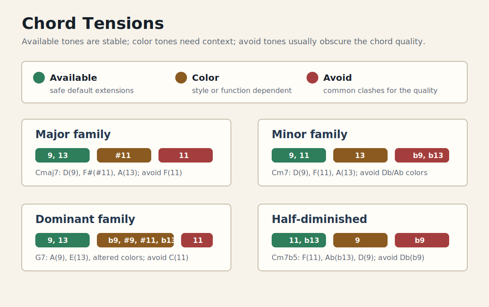

# Chord Tension Guide

Bluesify teaches chord tensions during analysis before using them in higher-level
arrangements. Tension suggestions are transposed from the chord root, so the
same rule works in every key.

## Supported Qualities

| Chord quality | Available tensions | Color tensions | Usually avoid |
|---------------|--------------------|----------------|---------------|
| Major family | `9`, `13` | `#11` | `11` |
| Minor family | `9`, `11` | `13` | `b9`, `b13` |
| Dominant family | `9`, `13` | `b9`, `#9`, `#11`, `b13` | `11` |
| Half-diminished | `11`, `b13` | `9` | `b9` |

## Major Family

For a major-family chord such as `Cmaj7`, `9` and `13` add color without
fighting the major 3rd. Natural `11` often clashes with the major 3rd, while
`#11` gives a brighter Lydian jazz color.

Example for `Cmaj7`:

| Role | Note |
|------|------|
| 9 | `D` |
| #11 | `F#` |
| 13 | `A` |
| avoid 11 | `F` |

When the chord is the IV chord in a major key, `#11` becomes an available
diatonic color. For example, `Fmaj7` in C major can use `G(9)`, `B(#11)`,
and `D(13)`.

## Minor Family

For a minor-family chord such as `Cm7`, `9` and `11` are the default stable
extensions. Natural `13` is useful when the sound is Dorian or more open, but
it should be taught as a color choice. `b9` and `b13` are darker and more
context-dependent.

Example for `Cm7`:

| Role | Note |
|------|------|
| 9 | `D` |
| 11 | `F` |
| color 13 | `A` |
| avoid b9 | `Db` |
| avoid b13 | `Ab` |

## Dominant Family

Dominant chords can stay inside with `9` and `13`, or become more tense with
altered colors. Natural `11` usually fights the major 3rd, so `#11` is the
cleaner upper extension when that color is wanted.

Example for `G7`:

| Role | Note |
|------|------|
| 9 | `A` |
| 13 | `E` |
| color b9 | `Ab` |
| color #9 | `A#` |
| color #11 | `C#` |
| color b13 | `Eb` |
| avoid 11 | `C` |

## Half-Diminished

For half-diminished chords such as `Cm7b5`, `11` and `b13` support the chord
quality cleanly. Natural `9` gives a smoother Locrian #2 sound; `b9` is darker
and less stable.

Example for `Cm7b5`:

| Role | Note |
|------|------|
| 11 | `F` |
| b13 | `Ab` |
| color 9 | `D` |
| avoid b9 | `Db` |

## Implementation Notes

The analysis stage emits these suggestions in `AnalysisResult.tension_summary`.
This keeps the teaching output separate from voicing generation. Later Level 5
arrangements can reuse the same suggestions when adding upper-structure notes
to piano voicings.
